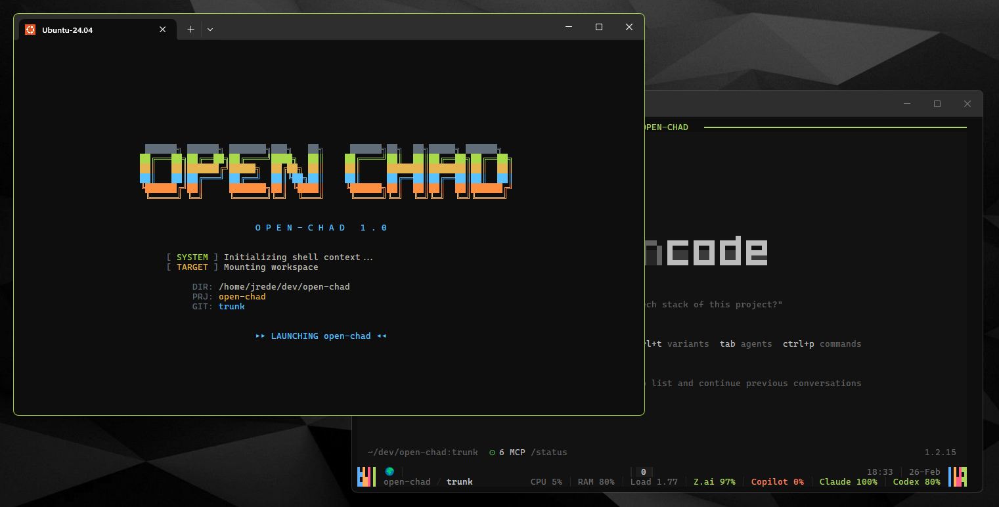
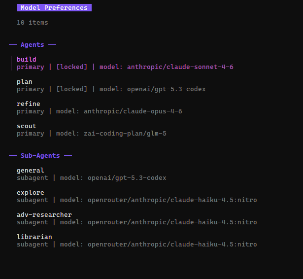

# openchad

[](https://github.com/JRedeker/open-chad/actions/workflows/ci.yml)
[](https://github.com/JRedeker/open-chad/releases)
[](LICENSE)
[](https://github.com/opencode-ai/opencode)

**A context engineering platform for AI-assisted development.** One install gives you a complete environment where every layer — agents, rules, tools, specs, and instructions — is designed to shape what your AI sees, what it can do, and how it behaves.

For developers who run multiple concurrent AI coding sessions and want everything configured out of the box.

Built for [OpenCode](https://github.com/opencode-ai/opencode). Inspired by [NvChad](https://github.com/NvChad/NvChad). Color theme by [opencode-ayu-theme](https://github.com/postrednik/opencode-ayu-theme), based on [ayu](https://github.com/ayu-theme/ayu).



---

## Highlights

- **Complete context-engineering stack:** layered instructions, priority-ranked rules, and scoped agents wired by default
- **Spec-driven workflow included:** [ADV](https://github.com/Sharper-Flow/Advance) plugin with 6 quality gates (research -> prep -> implementation -> review -> harden -> signoff)
- **MCP and tooling pre-wired:** [Vision](https://github.com/Sharper-Flow/vision) daemon + [Context7](https://context7.com), [grep.app](https://grep.app), [lgrep](https://github.com/Sharper-Flow/lgrep), [Firecrawl](https://www.firecrawl.dev), and [morph-fast-apply](https://github.com/steipete/morph-fast-apply)
- **Ops-ready terminal UX:** themed two-row tmux dashboard, live session count/CPU/RAM/load, and per-provider LLM fuel gauges
- **Multi-session workflow built in:** isolated `oc-<timestamp>-<pid>` sessions, `oc attach/switch`, `oc-list`, `oc-killall`, and `cds`
- **Quality-of-life extras:** [`omp`](https://github.com/JRedeker/opencode-model-preferences) model-preferences TUI popup, [Discord Rich Presence](https://discord.com/developers/docs/rich-presence/overview), [zsh](https://www.zsh.org) + completions, CI/release automation

## Included Components

| Area | Included by default |
|------|---------------------|
| Agents | `scout`, `build`, `refine`, `plan`, `explore`, `librarian`, `general`, `adv-researcher` |
| Instructions | identity, rules, shell strategy, MCP tool guide, worktree guide, LBP, post-install verification |
| Plugins | [ADV](https://github.com/Sharper-Flow/Advance) (spec-driven change management), [morph-fast-apply](https://github.com/steipete/morph-fast-apply) |
| MCP servers | [Context7](https://context7.com), [grep.app](https://grep.app), [lgrep](https://github.com/Sharper-Flow/lgrep), [Firecrawl](https://www.firecrawl.dev) (via [Vision](https://github.com/Sharper-Flow/vision) daemon) |
| Shell + UX | [zsh](https://www.zsh.org) environment, [Powerlevel10k](https://github.com/romkatv/powerlevel10k), [zsh-autosuggestions](https://github.com/zsh-users/zsh-autosuggestions), [fast-syntax-highlighting](https://github.com/zdharma-continuum/fast-syntax-highlighting), completions |
| Session tooling | `openchad`, `oc`, `cds`, `oc-list`, `oc-killall` |
| Status + metrics | 2-row ayu-dark tmux status, session title correlation, system metrics, dynamic LLM gauges |
| Collaboration extras | [Discord Rich Presence](https://discord.com/developers/docs/rich-presence/overview), WSL bridge support, [Windows Terminal](https://github.com/microsoft/terminal) keybinding helper |

### External Dependencies & Source Repos

Everything openchad pulls from external sources during install and runtime:

| Component | Type | Source Repository | Install Method |
|-----------|------|-------------------|----------------|
| [ADV (Advance)](https://github.com/Sharper-Flow/Advance) | Plugin | `github.com/Sharper-Flow/Advance` | git clone + pnpm build (always latest HEAD) |
| [morph-fast-apply](https://github.com/JRedeker/opencode-morph-fast-apply) | Plugin | `github.com/JRedeker/opencode-morph-fast-apply` | git clone + pnpm build |
| [omp](https://github.com/JRedeker/opencode-model-preferences) | Plugin | `github.com/JRedeker/opencode-model-preferences` | git clone + make install |
| [Vision](https://github.com/Sharper-Flow/vision) | MCP daemon | `github.com/Sharper-Flow/vision` | Pre-installed binary on PATH |
| [Context7](https://github.com/upstash/context7) | MCP server | `@upstash/context7-mcp@latest` | npx via Vision (port 6276) |
| [grep.app](https://grep.app) | MCP server | `@grep-app/mcp@latest` | npx via Vision (port 6288) |
| [lgrep](https://github.com/Sharper-Flow/lgrep) | MCP server | `github.com/Sharper-Flow/lgrep` | uvx via Vision (port 6285) |
| [Firecrawl](https://github.com/mendableai/firecrawl) | MCP server | `@mendableai/firecrawl-mcp@latest` | npx via Vision (port 6281) |
| [md-table-formatter](https://www.npmjs.com/package/@franlol/opencode-md-table-formatter) | npm plugin | `@franlol/opencode-md-table-formatter@latest` | Wired into opencode.json |
| [Powerlevel10k](https://github.com/romkatv/powerlevel10k) | Zsh theme | `github.com/romkatv/powerlevel10k` | git clone to `~/.zsh/plugins/` |
| [zsh-autosuggestions](https://github.com/zsh-users/zsh-autosuggestions) | Zsh plugin | `github.com/zsh-users/zsh-autosuggestions` | git clone to `~/.zsh/plugins/` |
| [fast-syntax-highlighting](https://github.com/zdharma-continuum/fast-syntax-highlighting) | Zsh plugin | `github.com/zdharma-continuum/fast-syntax-highlighting` | git clone to `~/.zsh/plugins/` |
| [npiperelay](https://github.com/jstarks/npiperelay) | WSL2 bridge | `github.com/jstarks/npiperelay` | go install (WSL2 only, optional) |
| [opencode-ayu-theme](https://github.com/postrednik/opencode-ayu-theme) | Color theme | `github.com/postrednik/opencode-ayu-theme` | Bundled (no runtime fetch) |

## Quick Navigation

- [Context Engineering, Out of the Box](#context-engineering-out-of-the-box)
- [What Else You Get](#what-else-you-get)
- [Install](#install)
- [First Run Checklist](#first-run-checklist)
- [Usage](#usage)
- [Configuration](#configuration)
- [Troubleshooting](#troubleshooting)
- [Requirements](#requirements)

## Quick Links

- [Latest Releases](https://github.com/JRedeker/open-chad/releases)
- [CI Workflow](https://github.com/JRedeker/open-chad/actions/workflows/ci.yml)
- [ADV Plugin](https://github.com/Sharper-Flow/Advance)
- [Vision MCP Daemon](https://github.com/Sharper-Flow/vision)
- [Discord Setup Guide](lib/discord/SETUP.md)
- [Architecture + Internals](AGENTS.md)

## Context Engineering, Out of the Box

AI coding tools are only as good as the context they operate in. openchad ships a complete context engineering stack so your agents start every session with the right knowledge, the right tools, and the right constraints — no manual wiring required.

### Layered Instructions & Rules
A priority-ranked rule system (25 rules, conflict resolution by priority) governs every agent interaction. Layered instruction files — identity, coding conventions, shell strategy, tool selection guides, TDD policy — are injected into every session automatically. Your agents follow your standards from the first prompt.

### Scoped Agent Orchestration
Eight specialized agents — **scout**, **build**, **refine**, **plan**, **explore**, **librarian**, **general**, and **adv-researcher** — each with explicitly scoped tool access. Scout is read-only. Plan blocks all writes. Refine has full access but is scope-locked to one objective. The right agent gets the right tools and nothing more.

Primary agent accent colors (`build`, `plan`, `scout`, `refine`) are persisted in `~/.config/opencode/open-chad.json` under `agentColors` and re-applied on setup/update. They are not stored in the OpenCode theme JSON:

```json
{
  "agentColors": {
    "build": "#59C2FF",
    "plan": "#FFB454",
    "scout": "#F07178",
    "refine": "#AAD94C"
  }
}
```

### Spec-Driven Development (ADV)
The [ADV plugin](https://github.com/Sharper-Flow/Advance) turns requirements into enforceable specs. A 6-gate quality workflow — research → prep → implementation → review → harden → signoff — ensures changes are validated against specs before archive. Accumulated wisdom carries forward across changes.

### Pre-Wired Tool Ecosystem
MCP servers for documentation lookup ([Context7](https://context7.com)), code search ([grep.app](https://grep.app)), semantic codebase search ([lgrep](https://github.com/Sharper-Flow/lgrep)), and web scraping (Firecrawl) are configured and ready. Agents can reach external knowledge without you wiring anything.

The [Vision](https://github.com/Sharper-Flow/vision) MCP daemon is bundled and managed automatically — started as a singleton on every `openchad` launch, restarted on `openchad update`, and health-checked by `openchad doctor`. No manual daemon management required.

### Project Context via AGENTS.md
Each project gets an `AGENTS.md` that documents architecture, conventions, data flow, and design decisions. Agents read it automatically — so they understand your codebase structure, not just the code.

---

## What Else You Get

### Zsh Shell Environment
Installs zsh with [Powerlevel10k](https://github.com/romkatv/powerlevel10k), [zsh-autosuggestions](https://github.com/zsh-users/zsh-autosuggestions), and [fast-syntax-highlighting](https://github.com/zdharma-continuum/fast-syntax-highlighting) — configured and ready. Shell completions for all openchad commands included.

### Live LLM Fuel Gauges
See remaining quota for Z.ai, GitHub Copilot, Claude, and OpenAI Codex directly in your tmux status bar. Color-coded: green ≥50%, yellow 20–49%, red <20%. Updated every 30 seconds.

### Synthwave Status Edges
Each tmux status bar position (left/right × row0/row1) renders a unique block-glyph edge in the agent color palette — build (blue) → plan (yellow) → scout (pink) → refine (green). The variant is derived from your session name, giving 256 possible combinations across all four positions. Every session looks slightly different.

These four colors are treated as official constants and centralized in `lib/agent_palette.sh`.

### Crash-Isolated Sessions
Every OpenCode instance runs in its own tmux session (`oc-<timestamp>-<pid>`). If one crashes, the rest are unaffected. Run 5, 10, or 20+ concurrent sessions without cascade failures.

Session teardown is session-scoped: `openchad` configures tmux to destroy only the launched `oc-*` session when the last attached client exits/detaches. It never uses `tmux kill-server`, so non-`oc-*` and unrelated tmux sessions remain untouched.

### Themed tmux Dashboard
Two-row ayu-dark status bar with repo/branch context, session titles correlated from OpenCode's database, live system metrics (session count, CPU, RAM, load), and a retro boot animation.

### Model Preferences (`omp`)

A terminal UI for managing OpenCode model preferences — switch models, set defaults, and configure per-agent overrides without editing JSON.

- Quick access in-session: press `Ctrl+b m` to open `omp` in a tmux popup.
- Popup behavior uses `display-popup -EE`: success closes automatically; failures stay visible.
- Default popup size is 80%×80%. Override with `OPEN_CHAD_OMP_POPUP_SIZE` (e.g. `export OPEN_CHAD_OMP_POPUP_SIZE="90%x85%"`).
- Popup runs from the active pane directory and launches `omp` through your shell login context for parity with terminal invocation.
- Override the popup binary path with `OPEN_CHAD_OMP_BIN` if needed (e.g. `export OPEN_CHAD_OMP_BIN="$HOME/.local/bin/omp"`).
- Requires tmux `>=3.2` for popup support. On older tmux versions, `prefix+m` shows a fallback hint.
- Preference changes apply on the next OpenCode agent/command invocation — no restart needed.



### Discord Rich Presence
Show your openchad activity in Discord with a single command. No Discord Developer account or app setup required — uses the built-in openchad App ID out of the box.

```bash
openchad discord enable          # Zero-prompt activation (built-in App ID)
openchad discord enable --custom # Use your own Discord app (advanced)
openchad discord status          # Check current mode and last update time
openchad discord disable         # Turn off
```

All dynamic input is sanitized — no project names, file paths, tokens, or secrets are ever transmitted. See [`lib/discord/SETUP.md`](lib/discord/SETUP.md) for the full guide.

**WSL2:** openchad auto-starts the Discord IPC bridge (`socat` + `npiperelay.exe`) as a singleton on every launch — no manual setup after the one-time dep install:
```bash
sudo apt install socat && go install github.com/jstarks/npiperelay@latest
ln -sf "$(go env GOPATH)/bin/windows_amd64/npiperelay.exe" "$(go env GOPATH)/bin/npiperelay.exe"
```

`openchad discord status` bridge states on WSL2:

| Status | Meaning |
|--------|---------|
| `ready` | Bridge process is running and Discord IPC forwarding is active |
| `not running` | Bridge deps are present, but no active bridge process was found |
| `missing socat` / `missing npiperelay.exe` | One-time dependency setup is incomplete |

---

## Install

Two commands on a fresh Ubuntu/Debian system:

```bash
git clone https://github.com/JRedeker/open-chad.git && cd open-chad
bash install.sh
```

The interactive wizard walks you through 10 steps:

| Step | What happens |
|------|-------------|
| 1 | System dependencies (git, curl, tmux, Node 20, pnpm) |
| 2 | OpenCode OAuth onboarding |
| 3 | Dev language bundles — Python (uv), Go, Rust, Web (TS/JS) |
| 4 | MCP servers wired into opencode.json |
| 5 | Vision MCP daemon registered and started |
| 6 | ADV + morph plugins installed |
| 7 | Agents, instructions, theme, slash commands synced |
| 8 | Model preferences TUI (`omp`) |
| 9 | Zsh + plugins configured |
| 10 | Windows Terminal keybindings (WSL only) |

For CI or unattended installs: `bash install.sh --yes`

After install, reload your shell (`source ~/.zshrc` or `source ~/.bashrc`) and you're ready.

## First Run Checklist

Run these once after install to validate the environment end-to-end:

```bash
openchad doctor            # verify PATH, tmux wiring, Vision daemon, and health checks
openchad discord status    # confirm Discord mode/bridge state (if enabled)
openchad ~/dev/your-project
```

If you use WSL2 + Discord, keep `openchad doctor` and `openchad discord status` as your first debug commands whenever presence is not updating.

### Update

```bash
openchad update
```

Pulls latest changes and re-runs all setup modules. Safe to run anytime.

### Verify

After launching OpenCode, paste the verification prompt from `~/.config/opencode/instructions/post_install_verification.md` to confirm everything is wired correctly.

### Uninstall

```bash
openchad uninstall
```

Removes managed shell profile blocks and disables managed runtime integrations. Your OpenCode config, plugin checkouts, and project files are left intact.

### Upgrading from `open-chad`

The command was renamed from `open-chad` to `openchad`. Running `openchad update` or `bash install.sh` auto-cleans stale aliases and PATH entries. Run `openchad doctor` to verify.

## Usage

```bash
openchad                        # Launch in current directory
openchad ~/dev/my-project       # Launch in specific directory
openchad --no-anim              # Skip boot animation

oc                              # Short alias (same as openchad)
oc x                            # Launch ~/dev/x from any directory
oc my-project --no-anim         # Launch ~/dev/my-project, skip animation
oc attach                       # Attach to a running session
oc switch                       # Pick a session to switch to

cds                             # Create ~/scratch/YYYY-MM-DD and launch there
cds 2026-01-15                  # Specific date

oc-list                         # List all running sessions
oc-killall                      # Kill all sessions (--yes to skip prompt)
```

Exit behavior: when the last client leaves a given `oc-*` session, that session is closed automatically. If multiple clients are attached to the same session, detaching one client does not close it; teardown happens only after the final client detaches.

### Project shorthand (`oc <name>`)

`oc` resolves bare project names to directories under `~/dev` so you can launch
from anywhere without `cd`:

```bash
oc x                  # → ~/dev/x
oc morph-fast-apply   # → ~/dev/oc-plugins/morph-fast-apply (one level deep)
oc shared             # → error: lists all matches if ambiguous
```

**Resolution precedence** (highest to lowest):

| Priority | Condition | Behavior |
|----------|-----------|----------|
| 1 | Subcommand (`update`, `doctor`, `version`, …) | Forwarded unchanged |
| 2 | Explicit path (`./x`, `../x`, `/abs`, `~/…`) | Forwarded unchanged |
| 3 | `~/dev/<name>` exists | Resolved to that path |
| 4 | Exactly one `~/dev/*/<name>` exists | Resolved with a stderr notice |
| 5 | Multiple `~/dev/*/<name>` exist | Exit 1 + disambiguation list |
| 6 | No match | Forwarded unchanged (openchad handles the error) |

Tab-completion offers project names from `~/dev` alongside subcommands, with
de-dup behavior: if a name exists both top-level and nested, only the top-level
name is suggested (matching runtime resolution precedence).

### Subcommands

```bash
openchad version                # Show version
openchad doctor                 # Validate install health
openchad update                 # Pull latest + re-run setup
openchad uninstall              # Remove openchad
openchad metrics                # Show system metrics
openchad metrics log            # Append timestamped reading to history
openchad metrics export         # Print as JSON
openchad changelog              # Git log since last tag
openchad changelog latest       # Show last tag release notes
openchad discord enable         # Turn on Discord Rich Presence
openchad discord enable --custom # Use your own Discord app
openchad discord status         # Check Discord status
openchad discord disable        # Turn off Discord Rich Presence
```

### CI/CD and Releases

- CI runs on every PR and every push to `trunk` (`.github/workflows/ci.yml`) and executes the full `npm test` suite.
- Release automation runs on version tags (`v*`) (`.github/workflows/release.yml`). It gates on passing tests, then:
  - generates release notes from commits since the previous tag,
  - updates `CHANGELOG.md` in the packaged artifact,
  - builds `openchad-<tag>.tar.gz` + `SHA256SUMS.txt`,
  - publishes a GitHub Release with all artifacts attached.

To cut a release:

```bash
git tag v1.2.3
git push origin v1.2.3
```

### Worktree Flow

When the ADV plugin creates a git worktree for an isolated change, openchad may open a new tmux window for it. The agent continues working inline — but you can navigate to the new tab with:

| Key | Action |
|-----|--------|
| `Ctrl+b n` | Next tmux window |
| `Ctrl+b l` | Last (previously active) window |
| `Ctrl+b w` | Interactive window chooser |
| `oc switch` | Switch between openchad sessions |

The agent emits this hint automatically after every `worktree_create` so you never have to remember the keybinds.

---

## Configuration

### LLM Provider Gauge

The fuel gauge auto-detects providers from your auth tokens in `~/.local/share/opencode/auth.json`. To show only specific providers, add to `~/.config/opencode/open-chad.json`:

```json
{
  "providers": ["zai", "claude"]
}
```

Valid IDs: `zai`, `copilot`, `claude`, `codex`.

To disable the gauge entirely: `export OPEN_CHAD_MULTI_GAUGE=0`

### omp Popup Size

The `Ctrl+b m` popup defaults to 80%×80% of your terminal. Override per-session or in your shell profile:

```bash
export OPEN_CHAD_OMP_POPUP_SIZE="90%x85%"   # wider/taller
export OPEN_CHAD_OMP_POPUP_SIZE="120x40"    # absolute cells
```

Format: `WxH` where W and H are any tmux size spec (percent or absolute).

For terminal-equivalent behavior, the popup runs from the active pane directory and resolves `omp` in this order:
1) `OPEN_CHAD_OMP_BIN` (if set and executable)
2) `$HOME/.local/bin/omp`
3) `omp` from `PATH`

Optional binary override:

```bash
export OPEN_CHAD_OMP_BIN="$HOME/.local/bin/omp"
```

### Re-running Install

`install.sh` is idempotent — safe to re-run anytime. It re-syncs config, pulls latest plugins, and merges opencode.json without duplicating entries.

---

## Troubleshooting

| Problem | Fix |
|---------|-----|
| `openchad: command not found` | Reload shell: `source ~/.zshrc` or `source ~/.bashrc` |
| opencode.json parse error | See [recovery steps](AGENTS.md#recovering-from-opencodejson-conflicts) |
| ADV plugin not loading | `bash lib/setup_adv.sh` |
| `prefix+m` says `omp` not found | Install/reinstall with `bash lib/setup_omp.sh` or set `OPEN_CHAD_OMP_BIN` |
| Missing MCP server | Check `~/.config/opencode/opencode.json` for the server entry |
| Theme looks wrong | `bash lib/setup_opencode.sh` |
| Vision MCP tools unavailable | Run `openchad doctor` to check daemon status; ensure `vision` binary is on PATH |
| `openchad doctor` reports issues | Follow the remediation instructions it prints |
| `prefix+m` popup not working | Requires tmux ≥3.2; run `tmux -V` to check |
| Discord not updating | Run `openchad discord status`; check `openchad doctor` for bridge status (WSL2) |
| Discord status shows `Bridge: not running` (WSL2) | Re-run one-time deps (`socat`, `npiperelay.exe`), then launch any `openchad` session to auto-start bridge |

For detailed installer internals, CI flags, architecture, and contributor docs, see [AGENTS.md](AGENTS.md).

---

## Requirements

- **Ubuntu / Debian** (Linux only — uses `/proc` for system metrics)
- **bash 4.0+**, **git**, **tmux 3.2+**
- **Node.js / npm** (for config merging)
- **OpenCode** — install from [opencode.ai](https://opencode.ai)

Everything else is installed automatically by the wizard.

---

## License

MIT
