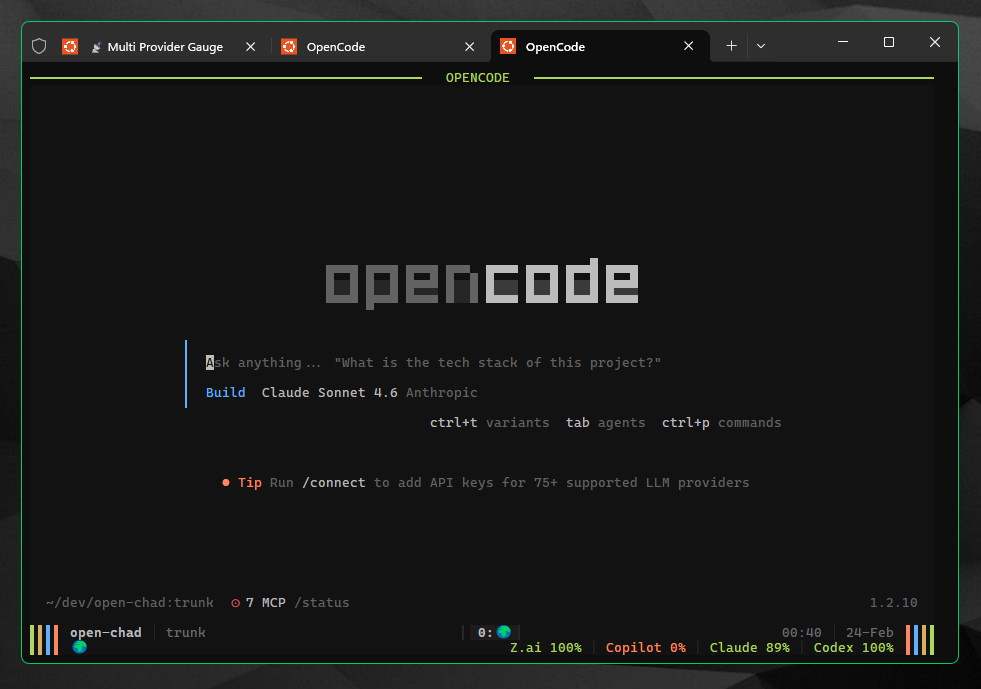

# open-chad

A retro tmux launcher and orchestrator for [OpenCode](https://github.com/opencode-ai/opencode).

Designed for developers who run 5-10+ concurrent OpenCode sessions and need instant visual context when switching tabs.

Inspired by [NvChad](https://github.com/NvChad/NvChad) and its focus on a fast, beautiful developer experience. Color theme by [opencode-ayu-theme](https://github.com/postrednik/opencode-ayu-theme), based on [ayu](https://github.com/ayu-theme/ayu).



## Features

- **Boot Animation**: Centered, color-cycling OPEN CHAD logo with typewriter subtitle and contextual launch sequence. Dynamically adapts to terminal size (skippable via `--no-anim`).
- **`cds` Scratch Launcher**: `cds [date]` creates `~/scratch/YYYY-MM-DD` and launches open-chad there. Ideal for quick throwaway sessions. Accepts an optional explicit date (`cds 2026-01-15`).
- **Unified ayu-dark Monitor**: Transforms tmux into a 2-row display using the ayu-dark palette (green, gold, blue, orange).
- **Smart Context Bar**: 
  - Left: repo name + branch.
  - Row 2 left: LLM fuel gauge + ADV window title parser (extracts `EMOJI REPO CHANGE_ID` into structured zones).
  - Row 2 right: live CPU%, RAM%, and load average.
- **LLM Fuel Gauge**: Displays per-provider quota remaining as `Z.ai 62% | Copilot 81% | Claude 47% | Codex 94%` in the tmux status bar. Each provider segment is color-coded: green ≥50%, yellow 20–49%, red <20%. Unknown or failed providers show `--` in gray. Updated live every 30s via background collector.
- **Shared System Metrics**: Background singleton collector tracks CPU%, RAM%, Load Avg, and LLM fuel across all sessions with near-zero overhead.
- **Crash Isolation**: Wraps every OpenCode instance in an isolated tmux session (`oc-<timestamp>-<pid>`) to prevent WSL/terminal cascade failures.

## Installation

**Fresh Ubuntu install (two commands):**

```bash
git clone https://github.com/JRedeker/open-chad.git && cd open-chad && bash install.sh
```

On an interactive TTY this launches a guided wizard. For non-interactive / CI use:

```bash
bash install.sh --yes
```

### Wizard steps

| Step | What it does |
|------|--------------|
| 1. System deps | Installs `git`, `curl`, `tmux`, Node 20, `pnpm` via apt (silent, logged) |
| 2. Claude auth | Step-by-step OAuth onboarding instructions for OpenCode |
| 3. Dev bundles | Multi-select: Python (uv), Go, Rust, Web (TS/JS) — press Enter to install all (default), 0 for none |
| 4. MCP servers | Wires `context7`, `grep-app`, `lgrep` (enabled) + `firecrawl`, `brave-web-search` (disabled) into `opencode.json` |
| 5. Plugins | Installs ADV spec-driven dev plugin and morph fast-apply plugin |
| 6. OpenCode config | Syncs agents, instructions, theme, and slash commands |
| 7. Model prefs (omp) | Installs `omp` (opencode-model-preferences) via `go install`. Skipped gracefully if Go is not installed. |
| 8. Zsh setup | Installs zsh + plugins (powerlevel10k, zsh-autosuggestions, fast-syntax-highlighting) into `~/.zsh/plugins/`, adds managed block to `~/.zshrc` |
| 9. Windows Terminal | Optional Shift+Enter / Ctrl+Backspace keybinding setup (generates `.ps1` on WSL) |

### Non-interactive flags

```bash
# Skip specific wizard steps
bash install.sh --yes --skip-deps --skip-auth --skip-bundles
bash install.sh --yes --skip-mcp --skip-adv --skip-morph
bash install.sh --yes --skip-omp --skip-zsh

# Select bundles non-interactively (comma or space separated, both work)
bash install.sh --yes --bundles python,go
bash install.sh --yes --bundles "python go rust web"

# Skip environment pre-flight check
bash install.sh --yes --no-env-check

# Legacy opt-out flags (still supported)
bash install.sh --no-adv
bash install.sh --no-omp
bash install.sh --no-opencode-setup
```

### Prerequisites

| Tool | Required | Notes |
|------|----------|-------|
| `bash` | Yes | 4.0+ |
| `git` | Yes | Cloning and update command |
| `tmux` | Yes | 3.2+ recommended |
| `node` / `npm` | Yes | For JSON config merging |
| `pnpm` | Auto-installed | Via npm if missing |
| `opencode` | Yes | Install from https://opencode.ai |
| `jq` | Optional | Used by metrics collector; not required by render path |
| Ubuntu/Debian | Yes | Linux only; `/proc` metrics; apt bootstrapping |

### What gets installed (v1.0)

| Component | Path | Notes |
|-----------|------|-------|
| Launcher | `~/.local/bin/open-chad` | Symlink |
| Scratch launcher | `~/.local/bin/cds` | Symlink — creates `~/scratch/<date>` and launches open-chad |
| tmux theme | `~/.tmux.conf` (sourced) | ayu-dark, 2-row |
| ADV plugin | `~/dev/oc-plugins/advance/` | Spec-driven dev |
| morph plugin | `~/dev/oc-plugins/morph-fast-apply/` | Fast-apply edits |
| Agents | `~/.config/opencode/agents/` | build, general, plan, scout, refine, librarian, explore, adv-researcher |
| Instructions | `~/.config/opencode/instructions/` | identity, rules, shell_strategy, mcp-tools, worktree-guide, lbp, post_install_verification |
| Commands | `~/.config/opencode/command/adv-*.md` | ADV slash commands |
| Theme | `~/.config/opencode/themes/ayu-dark.json` | ayu-dark color theme |
| opencode.json | `~/.config/opencode/opencode.json` | Plugin paths, MCP servers, instructions (additive merge) |
| Install state | `~/.config/opencode/open-chad.json` | Selected bundles, timestamps |
| Install log | `~/.config/opencode/open-chad-install.log` | Timestamped wizard log |

### Shell support (bash + zsh)

The installer automatically detects your active shell (`$SHELL`) and writes an idempotent `~/.local/bin` PATH export to the correct rc file:

| Shell | Target file |
|-------|-------------|
| `bash` | `~/.bashrc` |
| `zsh` | `~/.zshrc` |
| other / unknown | `~/.profile` |

The block is guarded by `# BEGIN open-chad` / `# END open-chad` markers — re-running the installer never duplicates it. After install, reload your shell:

```bash
source ~/.bashrc   # bash
source ~/.zshrc    # zsh
```

### Post-install verification

After launching OpenCode, paste the verification prompt from `~/.config/opencode/instructions/post_install_verification.md` to confirm auth, ADV plugin, lgrep MCP, morph plugin, theme, and agents are all working. The wizard prints this prompt at the end of installation.

### Updating

```bash
open-chad update
```

Requires a git-cloned install (errors clearly if run from a tarball/zip). Runs `git pull --ff-only` then re-applies all setup modules using your persisted bundle selections.

### Re-running install (idempotent)

`install.sh` is safe to re-run. It will re-sync config, pull latest plugins, and merge opencode.json without duplicating existing entries.

### Recovering from opencode.json conflicts

If `setup_mcp.sh` exits with an error about invalid or unparseable `opencode.json`, it will **not** automatically overwrite your config. This is intentional — silent auto-recovery was removed (CVE-003) to prevent data loss.

**Recovery options (choose one):**

**Option A — Restore from git backup (recommended):**
```bash
# If opencode.json is tracked in a dotfiles repo:
git checkout ~/.config/opencode/opencode.json
```

**Option B — Manual config merge:**
```bash
# Validate the file:
node -e "JSON.parse(require('fs').readFileSync('~/.config/opencode/opencode.json','utf8'))"
# Fix any syntax errors shown, then re-run:
bash install.sh
```

**Option C — Clean reinstall (last resort):**
```bash
# Back up first, then remove and reinstall:
cp ~/.config/opencode/opencode.json ~/.config/opencode/opencode.json.bak
rm ~/.config/opencode/opencode.json
bash install.sh
```

After recovery, re-run `bash install.sh` to re-apply MCP server wiring.

### Windows Terminal

The wizard (step 9) offers optional keybinding setup for Shift+Enter and Ctrl+Backspace in WSL. On WSL, it generates `~/open-chad-keybindings.ps1` — copy it to your Windows home and run in PowerShell:

```powershell
cp ~/open-chad-keybindings.ps1 /mnt/c/Users/$USER/
# Then in PowerShell:
.\open-chad-keybindings.ps1
```

On non-WSL systems, the wizard displays the JSON to add manually to your Windows Terminal `settings.json`.

### Opt-out flags

```bash
# Skip ADV plugin install (keep existing ADV setup)
./install.sh --no-adv

# Skip omp install
./install.sh --no-omp

# Skip all OpenCode config changes (agents, commands, instructions, opencode.json)
./install.sh --no-opencode-setup

# Skip everything new (tmux + symlink only)
./install.sh --no-adv --no-omp --no-opencode-setup
```

## Usage

```bash
# Launch OpenCode in current directory with animation
oc

# Launch in specific directory
oc ~/dev/my-project

# Skip the boot animation
oc --no-anim

# Create ~/scratch/YYYY-MM-DD and launch open-chad there
cds

# Use a specific date for the scratch directory
cds 2026-01-15

# List all running open-chad sessions with window count and memory usage
oc-list

# Kill all open-chad sessions (prompts for confirmation; use --yes to skip)
oc-killall
oc-killall --yes
```

## Architecture

- `bin/open-chad`: Main entrypoint. Handles arg parsing, animation trigger, metrics collector bootstrap, and tmux session isolation.
- `lib/animation.sh`: Pure bash boot animation. Dynamically centers on screen, cycles the logo through the ayu-dark palette, and typewriter-renders the subtitle. Uses true-color ANSI sequences.
- `lib/collect_metrics.sh`: Singleton daemon. Writes `$OPEN_CHAD_CACHE_DIR/metrics` (CPU/RAM/load) every 30s. Writes 4 per-provider LLM quota cache files every 30s: `$OPEN_CHAD_CACHE_DIR/zai`, `$OPEN_CHAD_CACHE_DIR/copilot`, `$OPEN_CHAD_CACHE_DIR/claude`, `$OPEN_CHAD_CACHE_DIR/codex`. Each file contains a plain integer 0–100 (remaining %), or is empty when the provider is unavailable. Auth tokens are read from `~/.local/share/opencode/auth.json` at runtime. Uses PID locks and safe parallel background jobs (`wait $pid || rc=$?`).
- `lib/status_left.sh`: Fast tmux `#()` renderer (Row 1 left). Shows worktree name and current git branch for the active pane. No external dependencies.
- `lib/status_right.sh`: Fast tmux `#()` renderer (Row 1 right). Reads system metrics cache (`$OPEN_CHAD_CACHE_DIR/metrics`) and 4 per-provider LLM quota cache files. Renders CPU/RAM/Load + LLM fuel gauges as one unit. No jq, no curl — plain bash.
- `lib/status_resources.sh`: Standalone Row 0 resource renderer (CPU/RAM/Load only). Available for custom tmux layouts; Row 1 uses `status_right.sh` which includes resources inline.
- `lib/title_parser.sh`: Fast tmux `#()` renderer. Parses ADV state strings (emoji + repo + changeId) for structured display in the window name area.
- `lib/theme.conf`: Sourced by `~/.tmux.conf`. Defines the 2-row ayu-dark status bar layout.

## LLM Provider Auth

The metrics collector reads auth tokens from `~/.local/share/opencode/auth.json` at runtime. Each provider uses a specific key path:

| Provider | auth.json key | API endpoint |
|----------|--------------|--------------|
| Z.ai | `zai-coding-plan.key` | `api.z.ai/api/monitor/usage/quota/limit` |
| GitHub Copilot | `github-copilot.access` | `api.github.com/copilot_internal/user` |
| Claude (Anthropic) | `anthropic.access` | `api.anthropic.com/api/oauth/usage` |
| OpenAI Codex | `openai.access` | `chatgpt.com/backend-api/wham/usage` |

If a token is missing or the API call fails, that provider's segment shows `--` — no crash, no effect on other providers.

## Toggle: `OPEN_CHAD_MULTI_GAUGE`

Controls whether the per-provider fuel gauge is shown in the status bar.

| Value | Behavior |
|-------|----------|
| unset / `auto` | Show gauge only if at least one provider cache file has valid data (default) |
| `1` / `true` / `yes` / `on` | Always show gauge (all 4 segments, unknown providers show `--`) |
| `0` / `false` / `no` / `off` | Never show gauge |

Set in your shell profile or `~/.tmux.conf`:

```bash
# Always show (even on a fresh install with no tokens):
export OPEN_CHAD_MULTI_GAUGE=1

# Never show:
export OPEN_CHAD_MULTI_GAUGE=0
```

The toggle affects both `collect_metrics.sh` (skips API calls when disabled) and `status_left.sh` (hides the segment when disabled).

## License

MIT
